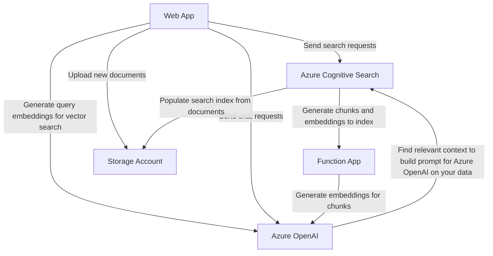

# Azure AI Search Playground

## About

This project provides a very easy to use learning and experimentation playground to try out various AI-enabled search scenarios in Azure. It provides a web application front-end which uses [Azure Cognitive Search](https://learn.microsoft.com/azure/search/search-what-is-azure-search) and [Azure OpenAI](https://learn.microsoft.com/azure/ai-services/openai/overview) to execute searches with a variety of options. This allows you to quickly understand what each option does, how it affects the search results, and how various approaches compare against each other.

By default, a few documents are added automatically to allow you to use the application directly. You're encouraged to upload your own documents (which you can also easily do via the web app) so you can experiment with searching over your own content.

There are a number of related and somewhat similar projects, most notably [ChatGPT + Enterprise data with Azure OpenAI and Cognitive Search](https://github.com/Azure-Samples/azure-search-openai-demo) and [Sample Chat App with Azure OpenAI](https://github.com/Microsoft/sample-app-aoai-chatGPT). The main differentiators for this project however are that it's extremely [easy to set up](#deployment) and that it's aimed to be a *teaching and experimentation app*, rather than a sample focusing on just one service or scenario, or showing how you can build a realistic production-ready service yourself.

**Learn about different options and fire off a search query:**

**See search results, including *semantic answers* when available:**

**Compare the results of various built-in scenarios:**

## Architecture

When you deploy the solution, it creates an [Azure Cognitive Search](https://learn.microsoft.com/azure/search/search-what-is-azure-search) service which indexes document content from a blob storage container. (Note that documents are assumed to be in English.)

The documents in the index are also chunked into smaller pieces, and vector embeddings are created for these chunks using a Function App based on the [Azure OpenAI Embeddings Generator power skill](https://github.com/Azure-Samples/azure-search-power-skills/tree/main/Vector/EmbeddingGenerator). This allows you to easily try out [vector and hybrid search](https://learn.microsoft.com/azure/search/vector-search-overview). With Azure Cognitive Search on its own, the responses *always* come directly from the source data, rather than being generated by an AI model. You can optionally use [semantic search](https://learn.microsoft.com/azure/search/semantic-search-overview) which *does* use AI, not to generate content but to increase the relevancy of the results and provide semantic answers and captions.

The solution also deploys an [Azure OpenAI](https://learn.microsoft.com/azure/ai-services/openai/overview) service. It provides an embeddings model to generate the vector representations of the document chunks and search queries, and a GPT model to generate answers to your search queries. If you choose the option to use [Azure OpenAI "on your data"](https://learn.microsoft.com/azure/ai-services/openai/concepts/use-your-data), these AI-generated responses can be grounded in (and even limited to) the information in your Azure Cognitive Search indexes. This option allows you to let Azure OpenAI orchestrate the [Retrieval Augmented Generation (RAG)](https://aka.ms/what-is-rag) pattern. This means your search query will first be used to retrieve the most relevant documents (or preferably *smaller chunks of those documents*) from your private data source. Those search results are then used as context in the prompt that gets sent to the AI model, along with the original search query. This allows the AI model to generate a response based on the most relevant source data, rather than the public data that was used to train the model.

## Deployment

Deploying the solution is as easy as clicking the "Deploy to Azure" button below. This gives you a fully configured environment to experiment with, and even comes with a few sample documents to search through.

Before you do that however, the most important choice you need to make is which Azure region to use, given the following constraints:

- The region must [support the GPT chat completions and embeddings models you want to use in Azure OpenAI](https://learn.microsoft.com/azure/ai-services/openai/concepts/models).
- The region must [support AI Enrichment in Azure Cognitive Search](https://azure.microsoft.com/explore/global-infrastructure/products-by-region/?products=search&regions=all) in order to use skillsets.
- At the time of writing (September 2023), if you are using `gpt-35-turbo` then only model version `0301` is supported for [Azure OpenAI on your data](https://learn.microsoft.com/azure/ai-services/openai/concepts/use-your-data); model version `0613` can therefore not be used with `gpt-35-turbo`, but it is supported when using `gpt-35-turbo-16k`.

This means the following Azure region and model combinations are currently supported:

| Azure Region      | `gpt-4` (version `0613`) | `gpt-4-32k` (version `0613`) | `gpt-35-turbo` (version `0301`) | `gpt-35-turbo-16k` (version `0613`) | `text-embedding-ada-002` (version `2`)
| ----------------- | -- | -- | -- | -- | -- |
| East US           | ✅ | ✅ | ✅ | ✅ | ✅ |
| France Central    | ✅ | ✅ | ✅ | ✅ | ✅ |
| UK South          | ✅ | ✅ | ✅ | ✅ | ✅ |
| Japan East        | ✅ | ✅ | ❌ | ✅ | ✅ |
| North Central US  | ❌ | ❌ | ❌ | ✅ | ✅ |
| Switzerland North | ❌ | ❌ | ❌ | ✅ | ✅ |
| South Central US  | ❌ | ❌ | ✅ | ❌ | ✅ |
| West Europe       | ❌ | ❌ | ✅ | ❌ | ✅ |

Once you've decided on a region, you can deploy the solution with its default parameters, or change these for your specific needs.

The following deployment parameters are used:

| Parameter | Purpose | Default value |
| --------- | ------- | ------------- |
| `resourcePrefix` | A prefix to use for all deployed Azure resources (maximum 8 characters, lowercase letters only) | |
| `embeddingModelName` | The name of the [Azure OpenAI embedding model](https://learn.microsoft.com/azure/ai-services/openai/concepts/models) to use | `text-embedding-ada-002` |
| `embeddingModelVersion` | The version of the embedding model to use | `2` |
| `embeddingModelVectorDimensions` | The [dimensions](https://learn.microsoft.com/azure/ai-services/openai/concepts/models#embeddings-models) of the vectors generated by the embedding model | `1536` |
| `gptModelName` | The name of the [Azure OpenAI GPT model](https://learn.microsoft.com/azure/ai-services/openai/concepts/models) to use | `gpt-35-turbo` |
| `gptModelVersion` | The version of the GPT model to use | `0301` |
| `searchServiceSku` | The [name of the Azure Cognitive Search service tier](https://learn.microsoft.com/azure/search/search-sku-tier) to use (note that this impacts certain [limits](https://learn.microsoft.com/azure/search/search-limits-quotas-capacity), for example the maximum blob size for indexers is 16 MB on the basic tier) | `basic` |
| `initialDocumentUrls` | A space-separated list of URLs for the documents to include by default | A [resiliency](https://azure.microsoft.com/mediahandler/files/resourcefiles/resilience-in-azure-whitepaper/Resiliency-whitepaper.pdf) and [compliance](https://azure.microsoft.com/mediahandler/files/resourcefiles/data-residency-data-sovereignty-and-compliance-in-the-microsoft-cloud/Data_Residency_Data_Sovereignty_Compliance_Microsoft_Cloud.pdf) document |

After the solution was deployed, simply browse to the App Service web app to start searching!

You can of course also deploy the [ARM template](azuredeploy-webapp.json) manually, and if you intend to run the web app locally then you can use the [`azuredeploy-webapp.ps1` PowerShell script](azuredeploy-webapp.json) to deploy the ARM template and automatically populate the required ASP.NET Core user secrets for the local web app.

## Authentication

By default, the web app is publicly accessible after deployment, which also means the document content is freely searchable. This isn't a problem for the documents that are included by default (which are public anyway), but if you're uploading your own documents you probably want to add authentication to the web app. This can easily be done by setting up the built-in [authentication and authorization feature on App Service](https://learn.microsoft.com/azure/app-service/overview-authentication-authorization), which can make the web app accessible only by users from your own organization for example.

## Configuration

The ARM template deploys the services and sets the configuration settings for the Web App and Function App. Most of these shouldn't be changed as they contain connection settings between the various services, but you can change the settings below for the App Service Web App.

> Note that the settings of the Function App shouldn't be changed, as the [power skill](https://github.com/Azure-Samples/azure-search-power-skills/tree/main/Vector/EmbeddingGenerator) was tweaked for this project to take any relevant settings from the request sent by the Azure Cognitive Search skillset instead of from configuration (for example, the embedding model and chunk size to use).

| Setting | Purpose | Default value |
| ------- | ------- | ------------- |
| `OpenAIApiVersion` | The API version of Azure OpenAI to use | `2023-06-01-preview` |
| `OpenAIEmbeddingDeployment`* | The deployment name of the [Azure OpenAI embedding model](https://learn.microsoft.com/azure/ai-services/openai/concepts/models) to use | `text-embedding-ada-002` |
| `OpenAIEmbeddingVectorDimensions` | The [dimensions](https://learn.microsoft.com/azure/ai-services/openai/concepts/models#embeddings-models) of the vectors generated by the embedding model | `1536` |
| `OpenAIGptDeployment` | The deployment name of the [Azure OpenAI GPT model](https://learn.microsoft.com/azure/ai-services/openai/concepts/models) to use | `gpt-35-turbo` |
| `StorageContainerNameBlobDocuments`* | The name of the storage container that contains the documents | `blob-documents` |
| `StorageContainerNameBlobChunks`* | The name of the storage container that contains the document chunks | `blob-chunks` |
| `TextEmbedderNumTokens` | The number of tokens per chunk when splitting documents into smaller pieces | `2048` |
| `TextEmbedderTokenOverlap` | The number of tokens to overlap between consecutive chunks | `0` |
| `TextEmbedderMinChunkSize` | The minimum number of tokens of a chunk (smaller chunks are excluded) | `10` |
| `SearchIndexNameBlobDocuments`* | The name of the search index that contains the documents | `blob-documents` |
| `SearchIndexNameBlobChunks`* | The name of the search index that contains the document chunks | `blob-chunks` |
| `SearchIndexerScheduleMinutes`* | The number of minutes between indexer executions in Azure Cognitive Search | `5` |
| `InitialDocumentUrls` | A space-separated list of URLs for the documents to include by default | A [resiliency](https://azure.microsoft.com/mediahandler/files/resourcefiles/resilience-in-azure-whitepaper/Resiliency-whitepaper.pdf) and [compliance](https://azure.microsoft.com/mediahandler/files/resourcefiles/data-residency-data-sovereignty-and-compliance-in-the-microsoft-cloud/Data_Residency_Data_Sovereignty_Compliance_Microsoft_Cloud.pdf) document |
| `DefaultSystemRoleInformation` | The default instructions for the AI model | You are an AI assistant that helps people find information. |
| `DisableUploadDocuments` | Set this to `true` to disable the functionality to upload documents, preventing uploads by users of the Web App (you can still upload documents directly to the Azure storage container if you have permissions there) | `false` |
| `DisableResetSearchConfiguration` | Set this to `true` to disable the functionality to reset the search configuration by users of the Web App | `false` |

*If you change this setting, you have to reset the search configuration (which can be done through the web app) to apply the new settings and regenerate the chunks and vectors.
